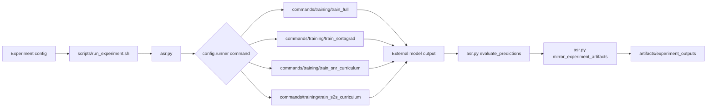

# Architecture

## Control flow

`scripts/run_sequence.sh` owns sequential orchestration. It preflights every
experiment, launches or waits for training, verifies completion sentinels,
exports item-level predictions, and mirrors lightweight artifacts.

## Module ownership

- `asr_experiments.config`: project-relative path resolution and JSON config loading.
- `asr_experiments.provenance`: file, canonical-JSON, and ordered-index hashes.
- `asr_experiments.jsonl`: direct and sibling-temporary JSONL writing contracts.
- `asr_experiments.audio`: common finite mono decoding and resampling.
- `asr_experiments.training.whisper`: common Whisper processor/model setup,
  dataset mapping, WER callbacks, and training arguments.
- `asr_experiments.training.provenance`: curriculum additions to run manifests.
- `asr_experiments.rq4.io`: fsync-backed atomic persistence for resumable RQ4 jobs.
- `experiment_core.samplers`: audited static and SortaGrad sampling.
- `experiment_core.dynamic_curriculum`: dynamic curriculum state and samplers.

`asr.py` is the only root Python entry point. Implementations live under
`asr_experiments/commands`, grouped by responsibility. Historical config runner
filenames remain stable identifiers that the launcher maps to command stems.

## Storage boundary

External storage is authoritative for heavy mutable runtime state: models,
checkpoints, optimizers, tokenizers, W&B runtime files, caches, and materialized
audio. The repository contains lightweight scientific evidence: predictions,
metrics, protocol summaries, logs, curriculum audits, comparisons, and hashes.
Historical pre-RQ outputs are consolidated under the repository-local but
Git-ignored `outputs/` directory; new confirmatory models continue to use
external storage.

## Failure boundaries

- Config validation fails before model construction.
- Launch preflight fails before a tmux session is created.
- Training completion requires model and train/validation/test result files.
- Prediction completion requires `item_predictions/summary.json`.
- Artifact mirroring validates hashes and excludes model/checkpoint files.
- Existing incomplete outputs require manual inspection; launchers do not erase them.

## Scientific compatibility

Immutable experiment configs and completed artifacts are not normalized into
inheritance templates. Their duplication preserves exact historical inputs and
hashes. Shared code consolidation keeps the original top-level symbols and CLI
entry points available while moving implementation ownership into focused
modules.