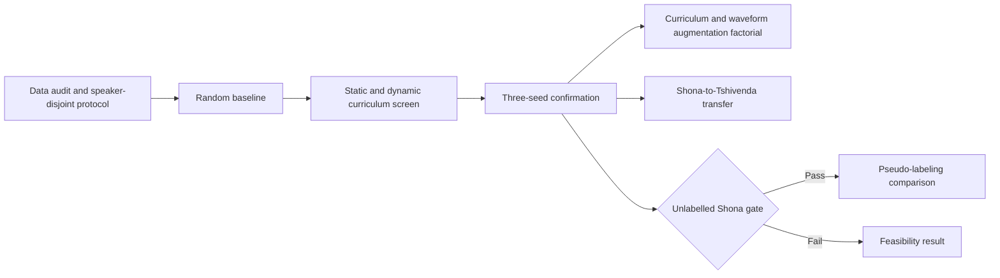

# Chapter 3: Methodology

> **Draft status.** This chapter distinguishes between completed experiments,
> exploratory archival experiments, and proposed experiments. Sections marked
> **planned** must be revised into past tense only after the corresponding
> experiments have been executed. The research questions below are working
> formulations and should be aligned with the final wording in Chapter 1.

## 3.1 Introduction

This chapter describes completed exploratory work and the preregistered
confirmatory methodology for curriculum learning in automatic speech recognition
(ASR) for Shona, a comparatively low-resource African language. Completed work
used pretrained multilingual speech models to examine whether controlling the
order and difficulty of training examples could improve recognition. The
confirmatory methodology is organized around experimental conditions rather
than chronology. It covers conventional fine-tuning, curriculum learning,
synthetic augmentation, cross-language transfer, and a pseudo-labeling study
that remains contingent on identifying suitable unlabelled Shona speech.

Two generations of experiments contributed to the study. The first was an
exploratory, notebook-based investigation containing model-scaling,
curriculum-learning, multilingual, and connectionist temporal classification
(CTC) experiments. The second used a configuration-driven training pipeline
with pinned model revisions, hashed data manifests, deterministic seeds, and
experiment tracking. Because these generations used different cleaned versions
of the WAXAL Shona manifests, they are documented as separate protocols and are
not treated as directly interchangeable experimental samples.

The remainder of this chapter presents the research design, dataset preparation,
baseline models, curriculum framework, augmentation and pseudo-labeling
protocols, experimental controls, evaluation measures, and implementation
environment.

## 3.2 Research Design

The study adopted a quantitative experimental design. ASR systems were trained
under controlled conditions and compared using corpus-level word error rate
(WER) on held-out speech. The principal independent variable was the training
schedule used to present labelled utterances. Additional independent variables
were model capacity, acoustic augmentation policy, and the inclusion of speech
from related languages. The principal dependent variable was WER; evaluation
loss was retained as a secondary optimization diagnostic.

The methodology was guided by four research questions:

- **RQ1:** What are the effects of static and dynamic acoustic data-level
  curriculum learning on the fine-tuning of ASR foundation models using limited
  Shona speech?
- **RQ2:** How does combining a curriculum scheduler with synthetic acoustic
  data augmentation affect the out-of-domain generalization of Shona ASR
  models?
- **RQ3:** To what extent is a curriculum schedule selected for Shona
  transferable to Tshivenda, another Bantu language?
- **RQ4:** To what extent can confidence-filtered pseudo-labeling improve Shona
  ASR performance beyond an otherwise matched supervised system?

Construction and validation of the speaker-disjoint data protocol is a
precondition for the confirmatory sequence. The experimental logic is therefore:

1. freeze the speaker-disjoint manifests, normalization, and acoustic metadata;
2. establish a non-curriculum baseline on that fixed Shona protocol;
3. compare static acoustic, dynamic model-based, and hybrid curriculum
  strategies;
4. cross the selected curriculum with one fixed synthetic augmentation policy;
5. transfer the frozen Shona curriculum to Tshivenda; and
6. evaluate pseudo-labelled speech if the unlabelled-data gate passes.

Only comparisons in which the model, dataset, training budget, random seed,
decoding configuration, and evaluation split were held constant were interpreted
as controlled comparisons. Earlier archival runs that changed more than one of
these factors were retained as exploratory evidence but were not used to make
causal claims about curriculum learning. Most completed experiments used one
random seed (42). The new confirmatory experiments therefore use seeds 42, 43,
and 44, which are shared across conditions as a paired design. Three seeds are
the minimum used here to expose gross run-to-run instability and provide a
non-degenerate empirical spread; inferential claims rely primarily on paired
item-level uncertainty rather than the seed sample alone. Small differences are
not interpreted as conclusive without replication and paired uncertainty
estimates.

## 3.3 Dataset and Data Preparation

### 3.3.1 WAXAL acquisition and NeMo manifest conversion

The primary data source was the Shona ASR subset (`sna_asr`) of the WAXAL speech
corpus. The published train, validation, and test splits were retained. Each
record included speech, a reference transcription, an utterance identifier,
speaker identifier, language, gender where available, and related metadata.

A conversion script loaded each split from `google/WaxalNLP`, skipped records
with empty transcriptions, and converted it to the JSON-lines manifest format
used by NVIDIA NeMo Speech Data Explorer (SDE). Audio bytes or source files were
materialized under a local split-specific audio directory, while source audio
encoding was preserved. Duration was measured from the audio frame count and
sample rate using SoundFile rather than accepted from unverified metadata. Each
manifest row stored the absolute audio path, measured duration, transcription,
utterance ID, and available speaker, language, and gender fields.

The resulting raw local manifests contained 14,109 training records, 1,727
validation records, and 1,749 test records. These local manifests allowed the
same audio and metadata to be inspected in SDE and processed reproducibly by
the subsequent scripts.

### 3.3.2 SDE-guided quality analysis and filtering

Speech Data Explorer was used to inspect utterance duration, transcript length,
speaking-rate outliers, unexpected characters, and suspect records. The
observations made during this inspection were translated into fixed rules in a
data-analysis notebook and a standalone cleaning script. Thus, SDE supported
exploration and review, while the actual inclusion decisions were generated by
code and recorded in auditable manifests.

For each utterance, the analysis calculated character and word counts and the
following rate measures:

$$
r_i^{\mathrm{char}}=\frac{\lvert y_i\rvert}{d_i},
\qquad
r_i^{\mathrm{word}}=\frac{\text{words}(y_i)}{d_i}.
$$

An utterance was automatically rejected when its duration was less than one
second, its character rate was below 1 or above 25 characters per second, or
its word rate exceeded 4 words per second. The same thresholds were applied to
all three published splits. Unexpected symbols and embedded newlines were
flagged for review but did not, by themselves, cause automatic rejection.

| Split | Input | Retained | Rejected |
|---|---:|---:|---:|
| Train | 14,109 | 13,799 | 310 |
| Validation | 1,727 | 1,683 | 44 |
| Test | 1,749 | 1,711 | 38 |

For each split, the process wrote five artifacts: a cleaned manifest, a rejected
manifest containing rejection reasons, an enriched manifest containing all
derived measurements, a CSV file for manual review, and a JSON policy record.
The policy record stored the fixed thresholds, input-manifest SHA-256 hash,
retained and rejected counts, and output paths. No source audio was deleted.

### 3.3.3 Silence trimming and acoustic audit

The retained training audio was examined for long trailing silence using
100-millisecond frames. A frame was considered active when its root mean square
(RMS) energy was within 40 dB of the recording's peak frame RMS. When at least
two seconds of trailing silence was detected, the recording was trimmed after
the last active region while retaining 250 milliseconds of end padding. Trimmed
audio was written as a new FLAC file and the original file was preserved. This
procedure modified 530 of the 13,799 retained training recordings; the remaining
13,269 recordings were unchanged. A CSV audit linked every original path and
duration to its output path, duration, and number of seconds removed.

An acoustic audit subsequently decoded every retained training recording and
measured duration agreement, sample rate, channel count, peak and global RMS
levels, clipping fraction, DC offset, active-speech ratio, leading and trailing
silence, and an SNR proxy. Exact decoded PCM hashes were also generated. All
training files decoded successfully and matched their manifest durations. No
clipping or residual trailing-silence failures were found under the selected
policy. Potentially difficult speech, including recordings with long leading
silence, a low active-speech ratio, or low amplitude, was flagged for review
rather than automatically removed.

### 3.3.4 Transcript normalization

One text contract was applied to train, validation, and test. Transcriptions
were normalized to Unicode NFC, typographic apostrophes were mapped to the ASCII
apostrophe, typographic dashes were standardized, and text was case-folded.
Letters, digits, and apostrophes were retained; other punctuation and symbols
were converted to spaces, after which repeated whitespace was collapsed. The
original transcription was preserved in a `text_raw` field and the normalized
form was stored in `text`. Normalization produced no empty transcriptions and no
non-Latin-script transcriptions. Twenty-seven training records containing
digits were flagged for Shona-specific verbalization review rather than being
expanded using English assumptions.

### 3.3.5 Experimental data protocols

Five related data protocols appeared across the experiments:

| Protocol | Purpose | Train | Validation | Test |
|---|---|---:|---:|---:|
| Archival cleaned protocol | Earlier model and dynamic-curriculum experiments | 13,343 | 1,620 | 1,635 |
| SDE-normalized full protocol | Reproducible baselines and augmentation | 13,799 | 1,683 | 1,711 |
| SDE curriculum-ready protocol | Static cumulative curriculum | 13,206 | 1,683 | 1,711 |
| Speaker-disjoint v1 | Diagnostic confirmatory-phase pilot | 13,778 | 1,696 | 1,719 |
| Speaker-disjoint v2 | Confirmatory curriculum experiments | 13,807 | 1,715 | 1,671 |

The archival protocol read separate `*.cleaned.json` manifests and then retained
audio between 0.1 and 30 seconds. It predates the SDE-normalized protocol and is
not directly interchangeable with it. The SDE-normalized full protocol contained
approximately 79.28 hours of training speech, 9.70 hours of validation speech,
and 9.93 hours of test speech. The curriculum-ready training subset excluded
593 quality-review records from the full normalized training set, but retained
them separately for audit rather than deleting them. No additional record met
the hard rejection rules after silence trimming and normalization.

The 593-record exclusion belongs only to the exploratory static cumulative
experiment. Confirmatory speaker-disjoint protocols pool the complete
SDE-normalized manifests and do not inherit that exclusion. Consequently,
legacy cumulative results and confirmatory curriculum results use different
training populations and are not direct replications.

Before model training, the newer pipeline verified that every referenced audio
file existed and every transcription was non-empty. SHA-256 hashes of all three
manifests were stored in each run manifest.

### 3.3.6 Model input preprocessing

All audio was decoded as mono speech and resampled to 16 kHz. The Whisper
feature extractor transformed each waveform into an 80-channel log-Mel
spectrogram. Inputs were padded or truncated to 3,000 frames, corresponding to
Whisper's 30-second input window. An attention mask was retained to distinguish
valid audio frames from padding. Target transcriptions were tokenized with the
Whisper multilingual tokenizer configured for Shona transcription. Target
sequences were padded within each batch, and padding tokens were replaced with
`-100` so that they did not contribute to the sequence-to-sequence loss.

### 3.3.7 Duplicate and split-leakage audit

Decoded PCM hashes were compared within and across all splits. No exact audio
duplicates were found within any split or across train, validation, and test.
Two repeated-transcription groups, containing four training records, were
retained because their audio differed. One normalized transcription was shared
between train and validation, but its audio was not duplicated.

The original WAXAL split did not provide a strong speaker-independent test. Of
97 validation speakers, 94 appeared in training; of 110 test speakers, 101
appeared in training. Furthermore, 1,700 of the 1,711 test utterances were
spoken by speakers represented during training. The reported experiments
therefore measure in-domain recognition more strongly than generalization to
unseen speakers. A speaker-disjoint split is required before making claims about
speaker-independent generalization.

The first speaker-disjoint assignment achieved zero overlap but concentrated
51.1% of validation rows in one speaker and 35.1% of test rows in one speaker.
It was therefore retained as a diagnostic pilot rather than the confirmatory
protocol. Version 2 used 113 training, 24 validation, and 24 test speakers and
constrained any held-out speaker to at most 20% of split rows and hours. Its
largest realized row shares were 19.5% in validation and 17.2% in test, with
zero speaker overlap across all splits.

### 3.3.8 Speaker-disjoint split construction

Speaker-disjoint construction pooled the three original normalized WAXAL
manifests and grouped all 17,193 utterances by speaker before assignment. No
speaker group was divided. Version 1 evaluated 20,000 seeded random assignments
and minimized imbalance in split row counts and durations. Its concentration
failure motivated version 2, which evaluated 50,000 assignments with 24 speakers
allocated to each held-out split.

For candidate assignment $a$, with target split proportion $r_k$, row count
$n_k(a)$, duration in hours $h_k(a)$, total rows $N$, and total duration $H$,
the optimization objective was

$$
J(a)=\sum_{k\in\{\mathrm{train,val,test}\}}
\left[
\left(\frac{n_k(a)-r_kN}{r_kN}\right)^2+
\left(\frac{h_k(a)-r_kH}{r_kH}\right)^2
\right].
$$

Only candidates in which no validation or test speaker contributed more than
20% of that split's rows or hours were eligible. The minimum-objective eligible
assignment produced 13,807 training, 1,715 validation, and 1,671 test
utterances, with 113, 24, and 24 speakers respectively. Assertions verified
complete utterance coverage, unique utterance IDs, existing audio, non-empty
text, and zero speaker overlap. Source and output manifests, assignments,
constraints, and hashes were stored in the protocol summary.

### 3.3.9 Related-language speech

Exploratory multilingual experiments supplemented Shona with Tshivenda and
isiZulu speech from a corpus referred to in the notebooks as African Next
Voices; its formal published title and primary citation must be verified before
submission. Auxiliary-language records were retained when their duration was
between 1 and 30 seconds, their character rate was between 1 and 25 characters
per second, their word rate did not exceed four words per second, and their
transcription was non-empty. The two-language training set contained 36,286
examples. The three-language set contained 53,186 examples and approximately
75.60 hours of Shona, 100.00 hours of Tshivenda, and 89.19 hours of recoverable
isiZulu speech. These multilingual experiments were exploratory and were not
curriculum-learning controls.

The exploratory multilingual notebooks did not constitute a curriculum-transfer
experiment. In particular, the training and evaluation language prompts were not
held constant across languages. The confirmatory Tshivenda study therefore uses
Tshivenda-only data and compares random ordering, a frozen Shona-derived
curriculum, and a Tshivenda-derived curriculum. Because Whisper does not provide
a dedicated Tshivenda language token, the same documented language-neutral
decoder prefix is used in every Tshivenda condition.

### 3.3.10 FLEURS out-of-domain evaluation data

The Shona configuration (`sn_zw`) of Google FLEURS contains 2,463 training, 393
validation, and 925 test utterances. FLEURS is read speech from a different
collection process and text domain than WAXAL and is therefore used as the
natural out-of-domain evaluation corpus for RQ2. No FLEURS utterance is included
in the confirmatory RQ2 training data or used to select its curriculum or
augmentation hyperparameters.

The corrected FLEURS protocol uses the WAXAL text contract: Unicode NFC
normalization, case-folding, standardized apostrophes and dashes, retention of
letters, Unicode numbers, combining marks, and apostrophes, replacement of other
punctuation and symbols with spaces, and whitespace collapse. The original
transcription is retained separately.

An initial exploratory preparation removed digits as well as punctuation. This
affected 531 FLEURS training records and created potential mismatches where a
spoken number had been deleted from its target. Runs made with that preparation
are retained as pilots but excluded from confirmatory comparisons. The initial
manifests also reused sentence IDs for multiple recordings. Version 2 assigns a
unique audio-derived utterance ID while retaining the earlier ID and source
sentence ID as provenance fields.

All 3,781 official utterances and their split memberships were retained. An
audit verified 16 kHz mono audio, exact manifest durations, unique utterance
IDs, no duplicate audio within or across FLEURS splits, and no decoded-PCM audio
overlap with WAXAL. The corrected manifests and audit are frozen before model
comparison; no FLEURS corpus metric is inspected until the RQ1 curriculum choice
is fixed using WAXAL validation only.

## 3.4 Baseline ASR Model

The principal ASR architecture was Whisper, a pretrained encoder-decoder
Transformer. Whisper converts a log-Mel spectrogram into hidden acoustic
representations with an encoder and autoregressively generates text tokens with
a decoder. The multilingual checkpoints were appropriate for transfer to Shona
because their pretraining included multilingual speech recognition and
translation objectives.

Whisper Tiny, Base, Small, Medium, Large, and Large-v3 checkpoints were examined
in the exploratory archive. The reproducible experiments concentrated on Base,
Medium, and Large. For these runs, generation was explicitly configured with
the language set to Shona and the task set to transcription. Forced decoder IDs
and the default suppressed-token list were cleared consistently across the
controlled runs. Predictions were generated greedily with a maximum sequence
length of 225 tokens.

Each pretrained checkpoint was also eligible for zero-shot evaluation before
fine-tuning, using the same manifests, language/task prompt, decoding limit, and
text contract as its fine-tuned counterpart. Greedy decoding was fixed across
controlled conditions because it is deterministic, computationally cheaper than
beam search, and avoids introducing a decoding-search factor into training
comparisons. The study does not claim equivalence with beam search; any decoding
sensitivity analysis is reported separately and is not used to select training
conditions.

The normalized baseline protocol fine-tuned each model for three epochs using a
learning rate of $1 \times 10^{-5}$, 500 warm-up steps, FP16 precision, gradient
checkpointing, and an effective batch size of six. Base used a physical batch
size of six. Medium used a physical batch size of two with three gradient
accumulation steps. Large used a physical batch size of one with six accumulation
steps and an 8-bit AdamW optimizer to fit GPU memory. Validation WER selected the
best checkpoint.

The model-scaling experiments established the appropriate capacity for later
experiments; differences between model sizes were not attributed to curriculum
or augmentation. A legacy `facebook/wav2vec2-base` CTC system and an incomplete
XLS-R attempt are treated as contextual archival evidence because architecture
comparison is not a research question and their text and optimization protocols
differed from the confirmatory Whisper protocol.

## 3.5 Curriculum Learning Framework

Curriculum learning changes the order or sampling distribution of training
examples so that optimization begins with examples considered easier and
progressively incorporates more difficult material. Let the labelled training
set be

This easy-to-hard principle follows Bengio et al. (2009). Duration-based
ordering follows the SortaGrad precedent in Deep Speech 2 (Amodei et al.,
2016), while static acoustic, model-loss, recognition-error, and pacing
criteria are motivated by Braun et al. (2017), Kuznetsova et al. (2022), and
Karakasidis et al. (2022, 2024). Except for the close C1 SortaGrad transfer,
the conditions below are literature-informed adaptations rather than direct
replications. The condition-by-condition classification and primary source list
are recorded in `documents/rq1_rq2_literature_defensibility.md`.

$$
\mathcal{D} = \{(x_i, y_i, d_i)\}_{i=1}^{N},
$$

where $x_i$ is an utterance, $y_i$ is its reference transcription, and $d_i$ is
its duration. A curriculum assigns each example a difficulty score $s_i$ and
constructs an ordering or stage schedule from those scores.

The confirmatory study distinguishes three curriculum families. Static acoustic
curricula calculate difficulty once from properties of the recording. Dynamic
model-based curricula update difficulty from the current model's loss or
recognition errors. The hybrid curriculum combines a fixed acoustic prior with
a model-based score updated at epoch boundaries. These definitions prevent a
dynamic pacing schedule over fixed scores from being confused with a curriculum
whose difficulty estimates themselves change during training.

For the primary acoustic ablation, duration and an active-speech SNR proxy are
converted to percentile ranks using the training split only. The preregistered
joint score is

$$
s_i^{\mathrm{acoustic}} =
0.5q_i^{d}+0.5(1-q_i^{\mathrm{SNR}}),
$$

where longer duration and lower SNR indicate greater difficulty. The hybrid
score at epoch $e$ is

$$
s_{i,e}^{\mathrm{hybrid}} =
0.5s_i^{\mathrm{acoustic}}+0.5q_{i,e}^{\mathrm{S2S}}.
$$

The percentile transformations, equal weights, and strict every-epoch C3
ordering are study-specific operational choices. No cited source establishes
this exact composite as an optimal ASR difficulty function.

A strict curriculum presents examples from lower to higher score with utterance
ID as the final deterministic tie-breaker. It does not use length grouping,
replacement, oversampling, or uniform difficulty mixing, and every example is
presented once per epoch. The cumulative curriculum is analyzed separately
because restricting the eligible pool changes exposure frequency. It is paired
with a mandatory random-subset pacing control, denoted C4R, of identical stage
sizes, exposure counts, and optimizer-update budget. This control distinguishes
difficulty-based pacing from any benefit caused solely by reducing the eligible
pool early in training.

The equal 0.5 acoustic and 0.5 S2S weights in the hybrid score are fixed before
the seed-42 screen and are not tuned on test results. If the hybrid is selected
for confirmation, a single preregistered sensitivity condition using weights
0.3 and 0.7 is evaluated to determine whether the conclusion depends strongly
on the equal-weight choice. No broader coefficient sweep is performed.

The two-signal confirmatory score is intentionally different from the legacy
four-signal static score below. It isolates the two acoustic variables named in
the confirmatory ablation, limits researcher degrees of freedom, and excludes
the transcript-derived word-rate deviation. Active-speech ratio remains an
audited quality variable and evaluation slice but is not part of the primary
confirmatory ranking score. Confirmatory SNR ordering, joint ordering, cumulative
C4 pacing, and the acoustic component of C7 all use the two-signal definition;
the four-signal definition is retained only to describe the archival static run.

### 3.5.1 Static cumulative curriculum

The static curriculum was constructed from the SDE-normalized training data.
The 593 review-flagged records were kept outside this experiment, leaving 13,206
quality-ready utterances. Four percentile-ranked signals were combined: duration
$q_i^{d}$, absolute deviation from the median word rate $q_i^{r}$, inverse SNR
rank $q_i^{n}$, and inverse active-speech-ratio rank $q_i^{s}$. The static
difficulty score was

$$
s_i^{\mathrm{static}} = 0.40q_i^{d} + 0.25q_i^{r}
+ 0.20q_i^{n} + 0.15q_i^{s}.
$$

The ranked data were divided into equal easy, medium, and hard thirds. Training
began with 4,402 easy examples (20.90 hours), expanded to 8,804 easy and medium
examples (45.55 hours), and finally used all 13,206 examples (75.68 hours).
Within each tier, records were ordered deterministically by difficulty score,
duration, and utterance ID. One implementation traversed these three cumulative
stages once, while a second repeated the full-data stage three times. Because
the variants had different total exposure counts, they were treated as separate
experiments rather than replications.

### 3.5.2 Duration-based SortaGrad

SortaGrad used utterance duration as a model-independent proxy for difficulty.
During the first epoch, examples were stably ordered from shortest to longest.
Subsequent epochs used seeded random permutations. No examples were removed or
oversampled. This strategy tested whether presenting shorter utterances first
could stabilize early optimization without repeatedly imposing a curriculum.
It closely transfers the Deep Speech 2 SortaGrad algorithm to Whisper, but does
not claim architectural replication of that CTC-style system.

### 3.5.3 Sequence-to-sequence margin curriculum

The sequence-to-sequence margin (S2S-M) strategy used the model's own training
loss to update the ordering. The first epoch was ordered by duration. During
that epoch, the summed token negative log-likelihood was recorded for each
utterance and normalized by its audio duration:

$$
s_i^{\mathrm{S2S}} =
\frac{-\sum_{t=1}^{T_i}\log p_\theta(y_{i,t}\mid y_{i,<t},x_i)}{d_i}.
$$

The S2S-margin name is retained for continuity with the archival experiments,
but the operational quantity is duration-normalized sequence negative
log-likelihood rather than a margin between competing hypotheses. Scores are
captured online during each example's training forward pass, before the
corresponding optimizer update, rather than by rescoring the complete training
set from one frozen epoch-boundary checkpoint. The resulting ranking is
therefore intentionally model-dependent and path-dependent.

This criterion adapts the model-loss curricula of Karakasidis et al. rather
than reproducing them: duration normalization, online pre-update collection,
strict no-mixing order, and the Whisper sequence-to-sequence model are local
design choices.

At the next epoch boundary, examples were ranked from lower to higher score,
with duration, utterance ID, and original index used as deterministic
tie-breakers. Scores were recomputed as the model changed, making this a
dynamic, model-dependent curriculum.

Duration ordering in the first epoch was an intentional bootstrap choice in the
archival implementation because no model-derived score yet existed. In the
confirmatory C5 and C7 conditions, epoch 1 instead uses the same seeded random
order as C0 while collecting S2S scores. This prevents the dynamic treatment
from inheriting the SortaGrad intervention tested separately in C1.

### 3.5.4 WER-margin curriculum

The WER-margin (WER-M) strategy estimated example difficulty from recognition
errors. Before the training forward pass, each batch was decoded greedily and a
per-example WER was calculated:

$$
s_i^{\mathrm{WER}} =
\frac{S_i+D_i+I_i}{N_i},
$$

where $S_i$, $D_i$, and $I_i$ are the substitution, deletion, and insertion
counts for utterance $i$, and $N_i$ is the number of words in its reference.
Scores were min-max normalized within the completed scoring period and used to
rank the next epoch. This method more directly represented recognition
difficulty than duration, but it added generation overhead to training.

Utterance WER is the closest direct dynamic criterion to Karakasidis et al.,
but greedy Whisper decoding and removal of their uniform difficulty-mixing
regularizer make C6 an implementation adaptation.

Confirmatory C6 also uses the C0 seeded random order in epoch 1 while collecting
WER scores. Its computational overhead is measured directly as GPU time and
wall-clock time relative to C0 rather than assumed in advance. Cost-effectiveness
is reported alongside recognition performance.

### 3.5.5 Uniform difficulty mixing

The dynamic margin curricula divided the ranked examples into easy, medium, and
hard thirds. To prevent the beginning of an epoch from containing only easy
speech, 20% of the easy third was replaced by examples sampled from the other
tiers. Of the replacement examples, 40% came from the medium tier and 60% from
the hard tier. With 13,343 examples, this injected approximately 356 medium and
533 hard examples into the early portion of each completed epoch. Sampling used
a deterministic seed.

Uniform difficulty mixing is an archival regularizer only. Confirmatory C5, C6,
and C7 use strict deterministic ordering without the 20% exchange so that the
difficulty criterion remains the only changed factor.

The archival curriculum experiments are valuable for comparing candidate
mechanisms, but they do not form a complete causal ablation because training
steps, total sample exposures, evaluation frequency, and in some cases data
splits differed. A final confirmatory comparison should rerun the clean control,
SortaGrad, S2S-M, and WER-M with the same normalized manifests, model revision,
three-epoch budget, optimizer, batch size, and seeds.

The planned seed-42 screen contains conventional shuffle, SortaGrad,
SNR-only ordering, joint SNR-duration ordering, cumulative acoustic tiers, its
mandatory random-pacing control C4R, S2S-M, WER-M, and the acoustic-plus-S2S
hybrid. Only the strongest static and dynamic strategies are repeated with seeds
43 and 44. Whisper Base is used for screening; promotion to Whisper Medium
occurs only after an improvement that is consistent across additional training
seeds and paired uncertainty analyses.

The null outcome is specified in advance. If no curriculum produces a
consistent improvement over conventional shuffle across validation, additional
seeds, and paired uncertainty analyses, RQ1 is answered as evidence that the
investigated curricula do not materially improve Whisper fine-tuning under this
speaker-disjoint low-resource protocol. Augmentation and transfer experiments
remain interpretable under this outcome and are not presented as attempts to
rescue a preferred curriculum conclusion.

## 3.6 Data Augmentation

### 3.6.1 Feature-level augmentation

Feature-level augmentation was investigated using SpecAugment applied to Whisper's
log-Mel input features. Time warping was omitted; only time masking and frequency
masking were used. Augmentation was performed online and only while the model was
in training mode. Validation, test, and inference features remained unchanged.

The mild policy used a time-mask probability of 0.05, a time-mask length of
eight frames, and at least one time mask. It also used a frequency-mask
probability of 0.05, a frequency-mask length of eight Mel channels, and at least
one frequency mask. Masked feature values were set to zero.

Three principal conditions were defined:

| Condition | Clean presentation probability | Mild SpecAugment probability |
|---|---:|---:|
| Clean control | 1.0 | 0.0 |
| Always-augmented | 0.0 | 1.0 |
| Mixed augmentation | 0.5 | 0.5 |

For the mixed condition, a Bernoulli draw was made independently for each
example at each presentation. Thus, the physical dataset was not doubled and no
augmented features were stored. Across three epochs, each utterance was expected
to be presented approximately 1.5 times clean and 1.5 times with newly sampled
masks. PyTorch's seeded random-number generator and deterministic training mode
controlled both the mask generation and clean-versus-augmented selection.

The controlled augmentation experiments kept model revision, manifests, seed,
training schedule, effective batch size, decoding, and evaluation fixed. A mild
always-on policy was completed for Base and Medium, and the Base mixed policy
was also completed. A stronger literature-derived policy was configured but
should not be described as executed unless run artifacts are confirmed.
Exploratory Medium continuation stages and their outcomes are reported in
Chapter 4 because continuation is not part of the confirmatory curriculum or
augmentation design.

### 3.6.2 Synthetic waveform augmentation for RQ2

RQ2 uses synthetic waveform augmentation rather than treating SpecAugment as
synthetic audio. The planned policy combines additive non-speech noise at a
recorded target SNR, room-impulse-response convolution, and mild tempo
perturbation. Transform parameters and random seeds are recorded per utterance.
Validation, WAXAL test, and FLEURS audio remain unmodified; fixed corrupted WAXAL
test sets are generated separately for robustness analysis.

The transform families follow established ASR augmentation work: Ko et al.
(2015) motivate 0.9/1.0/1.1 factors, and Ko et al. (2017) and OpenSLR SLR28
provide the basis for simulated-RIR and point-source-noise augmentation. The
frozen primary policy uses the Apache-2.0 SLR28 point-source noise and
simulated-RIR subsets. Additive noise is applied with probability 0.5 at a
target SNR sampled uniformly from 10 to 25 dB, simulated RIR convolution with
probability 0.3, and pitch-preserving tempo perturbation with probability 0.5
using factors 0.9 or 1.1 with equal probability. Transform order is tempo, RIR,
noise, then anti-clipping gain. These probabilities, the 10--25 dB range,
one-view materialization, asset subset, and composition order are frozen
study-specific choices, not literature-established optima. A seed-specific
immutable training set and parameter audit are generated before training; full
asset and manifest hashes are retained.

The selected curriculum is crossed with this one fixed waveform policy in a
$2\times2$ factorial: conventional clean training, curriculum only,
augmentation only, and curriculum plus augmentation. Model initialization,
training data, total updates, batch size, optimizer, seed set, decoding, and
checkpoint selection are identical across cells. SpecAugment is disabled in all
four cells so that the interaction estimates waveform augmentation specifically
without introducing a third augmentation factor. Stacking SpecAugment with the
selected waveform policy is reserved as a later sensitivity analysis only if the
factorial first establishes a benefit. The FLEURS test split is evaluated only
after all choices are frozen.

## 3.7 Pseudo-Labeling

> **Planned protocol; not yet executed.** No completed pseudo-labeling run was
> found in either experiment repository. This section records the intended
> protocol and must be updated with the actual corpus, thresholds, and sample
> counts if pseudo-labeling is included in the final thesis.

Pseudo-labeling is intended to exploit speech for which manually verified Shona
transcriptions are unavailable. The best supervised model selected using the
validation split would act as a teacher and generate candidate transcriptions
for an unlabelled speech pool. The unlabelled pool must first be checked for
audio duplication and speaker overlap with the validation and test sets. Test
audio must never enter teacher selection, confidence-threshold selection, or
student training.

The `unlabeled` split of `google/WaxalNLP` configuration `sna_asr` is selected as
the candidate source at pinned revision
`5f4d8ca24f2b9d168b2ee545f1febaaff4b40580`. The dataset server reports 85,384
rows, and the Shona provider data are released under CC-BY-SA-4.0. Selection as
a candidate does not imply admission: language composition, absent
transcriptions, speaker metadata, recording provenance, decoded-audio overlap,
and usable duration must be audited first. Failure to retain at least 20--40
usable hours after filtering is reported as a feasibility outcome rather than
bypassed by treating labelled WAXAL or FLEURS speech as unlabelled.

For each unlabelled utterance $x_j$, the teacher generates a deterministic
transcription $\hat{y}_j$ from unaugmented audio and a length-normalized token
log-probability. Confidence is calibrated against true transcription error on
labelled development speech. Candidate pairs are also checked for empty or
truncated output, repeated n-grams, implausible speaking rate, excessive text
compression, high no-speech probability, and disagreement between deterministic
and perturbed decodes. The retained pseudo-labelled set is

$$
\widehat{\mathcal{D}}_u =
\{(x_j,\hat{y}_j):c_j \geq \tau\},
$$

where $c_j$ is teacher confidence and $\tau$ is the fixed acceptance threshold.
The pseudo-label study proceeds only if a licensed Shona pool remains large
enough after deduplication and filtering to provide a meaningful addition to the
gold corpus. A stratified manual audit estimates label error across sources,
durations, and confidence ranges before student training. Gold examples retain
at least equal sampling weight. The initial pseudo-label loss weight of 0.5 is a
conservative preregistered starting value intended to reduce the influence of
noisy targets; it is not treated as a universal literature-derived optimum. If
the filtered condition improves validation performance, weights 0.25 and 1.0
form a limited sensitivity analysis without test-based tuning.

The RQ4 comparison contains a gold-only control, gold plus unfiltered
pseudo-labels, gold plus confidence-filtered labels, and an optional
confidence-paced condition that introduces lower-confidence labels later. All
conditions use the same student initialization, gold exposure, optimizer-update
budget, and test sets. The teacher checkpoint, unlabelled corpus version,
decoding parameters, calibration data, filtering thresholds, accepted and
rejected hours, audit results, manifest hashes, and student initialization are
recorded. Iterative relabeling is attempted only if the first filtered student
improves validation performance without increasing insertion or repetition
errors.

## 3.8 Experimental Design

The experiments were organized into the following matrix:

| Family | Conditions | Protocol | Status | Evidential role |
|---|---|---|---|---|
| Model baseline | Whisper Tiny, Base, Small, Medium, Large, Large-v3 | Legacy | Completed and partial runs | Exploratory capacity study |
| Reproducible baseline | Whisper Base, Medium, Large; three epochs | Normalized | Completed | Non-curriculum reference |
| Static curriculum | Cumulative tiers v1 and v2 | Legacy | Completed | Exploratory curriculum |
| Ordering curriculum | SortaGrad | Legacy | Partial | Exploratory curriculum |
| Dynamic curriculum | S2S-M and WER-M | Legacy | Completed | Exploratory strategy comparison |
| CTC baseline | Wav2Vec2 Base; partial XLS-R | Legacy | Mixed | Contextual architecture evidence |
| Multilingual transfer | Shona+Tshivenda; Shona+Tshivenda+isiZulu | Legacy | Completed pilots | Exploratory transfer study |
| Feature augmentation | Clean, always-on mild, 50/50 mixed | Normalized | Completed and configured runs | Controlled SpecAugment study |
| RQ1 curriculum screen | Shuffle, SortaGrad, SNR, SNR-duration, cumulative, C4R random pacing, S2S-M, WER-M, hybrid | Fixed confirmatory protocol | In progress | Primary confirmatory study |
| RQ2 curriculum + synthesis | $2\times2$ curriculum-by-waveform-augmentation factorial | WAXAL train; WAXAL and FLEURS evaluation | Planned | Confirmatory interaction study |
| RQ3 curriculum transfer | Tshivenda random, Shona-derived, Tshivenda-derived | Fixed Tshivenda protocol | Planned | Confirmatory transfer study |
| RQ4 pseudo-labeling | Gold, unfiltered, filtered, confidence-paced | Fixed after unlabelled corpus selection | Contingent | Confirmatory or feasibility study |

For controlled experiments, the validation set was evaluated periodically and
the checkpoint with the lowest validation WER was selected. The test set was
reserved for final evaluation of the selected checkpoint. Test WER was not used
to choose a checkpoint or tune hyperparameters. Where earlier notebook
experiments repeatedly evaluated the test set, this was documented as a risk of
implicit test-set adaptation.

The normalized Base, Medium, and Large experiments used seed 42 and three
epochs. Medium and Large were evaluated, logged, and checkpointed every 1,000
optimizer steps; Base used epoch-based evaluation in the original baseline and
1,000-step evaluation in the deterministic augmentation controls. Augmentation
effects were interpreted only against the same model size and data protocol.
Changes smaller than 0.5 absolute WER points were predeclared as requiring
additional evidence rather than being treated as practically meaningful.

All confirmatory curriculum runs evaluate and save at epoch boundaries. This
ensures that the final epoch is eligible for best-model selection and prevents
mid-epoch checkpoints from representing systematically different exposure under
random and easy-to-hard schedules. For the v2 Base protocol, epoch checkpoints
occur at optimizer steps 2,302, 4,604, and 6,906. All three are retained, and
the checkpoint with the lowest validation WER is used for final test prediction.
Curriculum score state and the next epoch order are stored with curriculum
checkpoints; exact resume is supported only at epoch boundaries.

The seed-42 curriculum screen is used only to remove clearly unpromising
strategies. Confirmatory comparisons use seeds 42, 43, and 44, shared across
conditions to reduce comparison variance. RQ1 controls are reused in RQ2 only
where all configuration fields and manifest hashes agree. The Shona curriculum
is selected before Tshivenda training, and FLEURS test and all final test splits
are unavailable for hyperparameter selection.

In addition to point estimates, paired bootstrap resampling over test utterances
is used to estimate a 95% confidence interval for the WER difference between
each intervention and its matched control. Where repeated utterances share a
speaker, resampling is clustered by speaker. Differences below 0.5 absolute WER
points are treated as practically unresolved unless uncertainty estimates and
replication provide contrary evidence.

Every confirmatory run saves item-level identifiers, speaker identifiers,
references, predictions, and per-item error counts for validation and test.
These artifacts are produced by a standalone post-training evaluator when the
training runner does not emit predictions directly. A run is not considered
analysis-complete until these prediction files and their hashes are present.
The implemented evaluator is `evaluate_predictions.py`; it writes separate
validation and test JSONL files plus a hash-bearing summary.

Based on observed runs on one RTX 4090, a Whisper Base condition requires
approximately 0.6--1.0 GPU hours including periodic evaluation, while a Whisper
Medium condition requires approximately 2.5--3.0 GPU hours. The seed-42 RQ1
screen therefore requires approximately 6--10 GPU hours before additional
WER-M decoding overhead. The planned confirmatory program excluding
pseudo-label generation is expected to require roughly 40--60 GPU hours. Actual
runtime, preprocessing, evaluation, and failed-run costs are reported from run
manifests rather than replaced by these planning estimates.

## 3.9 Evaluation Metrics

The primary evaluation metric was corpus-level word error rate:

$$
\mathrm{WER}=\frac{S+D+I}{N}\times 100\%,
$$

where $S$, $D$, and $I$ are the total word substitutions, deletions, and
insertions, and $N$ is the total number of reference words. Lower WER indicates
better recognition performance. Corpus WER was calculated with the `evaluate`
and `jiwer` packages after removing special tokens from model predictions.

The normalized Whisper experiments used the normalized manifest text as the
reference and did not apply an additional post-decoding normalizer. The legacy
Whisper experiments generally preserved their reference casing and punctuation,
whereas the CTC experiments lowercased text, removed combining marks, and
restricted the character inventory. WER values from these different text
protocols were therefore not treated as directly comparable.

Relative WER reduction may be reported as

$$
\mathrm{WERR}=\frac{\mathrm{WER}_{\mathrm{control}}-
\mathrm{WER}_{\mathrm{system}}}{\mathrm{WER}_{\mathrm{control}}}\times100\%.
$$

Evaluation loss was recorded to monitor optimization but was not used as the
primary measure of transcription quality. Training loss, runtime, GPU memory
requirements, and checkpoint size were retained as implementation diagnostics.
Given the speaker overlap in WAXAL v1, full-split WER should be supplemented by
speaker-disjoint evaluation before making generalization claims.

Character error rate was reported as a secondary metric because Shona and
Tshivenda are morphologically rich and word-level errors may obscure smaller
orthographic improvements. It was calculated as

$$
\mathrm{CER}=\frac{S_c+D_c+I_c}{N_c}\times 100\%,
$$

where $S_c$, $D_c$, $I_c$, and $N_c$ are character substitutions, deletions,
insertions, and reference characters. WER and CER are computed by summing edit
counts over the complete corpus or analysis slice. Single-word references are
retained without special treatment; per-utterance error percentages are not
averaged because doing so would give short references disproportionate weight.

RQ1 additionally reports WER and CER by duration and
SNR quartile and convergence against optimizer updates and audio hours seen.
RQ2 reports clean WAXAL, corrupted WAXAL, and natural OOD FLEURS performance.
RQ3 reports the transfer efficiency

$$
\mathrm{TE}=
\frac{\mathrm{WER}_{\mathrm{random}}-\mathrm{WER}_{\mathrm{Shona\ transfer}}}
{\mathrm{WER}_{\mathrm{random}}-\mathrm{WER}_{\mathrm{Tshivenda\ native}}},
$$

when the denominator is positive. If the Tshivenda-native curriculum does not
beat random and the denominator is zero or negative, transfer efficiency is
reported as undefined; the random, transferred, and native WERs and their paired
differences are reported directly. RQ4 reports retained pseudo-labelled hours,
estimated label error, insertion/deletion/substitution rates, empty-output rate,
and repeated n-grams in addition to downstream WER and CER.

## 3.10 Implementation Details

The reproducible pipeline was implemented in Python 3.10.12 using PyTorch
2.5.1, Transformers 4.46.3, Datasets 2.20.0, Accelerate 1.1.1, Evaluate 0.4.2,
JiWER 3.0.4, NumPy 1.26.4, bitsandbytes 0.45.5, and Weights & Biases 0.28.2.
Training was performed on an NVIDIA GeForce RTX 4090 with 24 GB of GPU memory
and CUDA 12.4.

The newer training system used versioned JSON experiment configurations and a
shared `Seq2SeqTrainer` implementation. Each configuration specified the model
identifier and immutable revision, manifest paths, language and task, random
seed, batch and accumulation settings, optimization schedule, augmentation
policy, checkpoint behavior, output location, and experiment-tracking metadata.
Long-running jobs were launched inside detached `tmux` sessions so that training
continued after SSH disconnection. Resource guards checked available GPU memory
and disk capacity before launch.

Before training, the pipeline wrote the resolved experiment configuration and a
run manifest containing SHA-256 hashes of the trainer, configuration,
dependency file, data manifests, and any local parent model. The manifest also
recorded package versions, Python and PyTorch versions, CUDA availability, GPU
model, effective seed, training duration, and output directory. W&B logging was
restricted to an approved existing project.

The confirmatory phase currently uses one standalone experiment directory per
run and a centralized output root. The original baseline trainer remains
unchanged for random controls, and the standalone item-prediction evaluator is
implemented. Planned static and dynamic treatments will use a separate
curriculum runner with tested sampler and epoch-boundary scoring interfaces.
Before SNR-dependent runs begin, duration, SNR proxy, and active-speech metadata
will be recomputed or verified for every speaker-disjoint manifest row; missing,
duplicate, or non-finite values will cause preflight failure.

The archival notebook experiments predated this infrastructure. Their methods
were reconstructed from notebook source cells, saved `trainer_state.json`
files, result JSON files, checkpoints, and local W&B metadata. Saved metric and
trainer-state files were treated as stronger evidence than displayed notebook
outputs because some notebooks contained stale or copied output cells. Runs
interrupted by out-of-memory errors or manual termination were identified as
partial rather than completed experiments.

### 3.10.1 Licensing and ethical considerations

FLEURS is distributed under CC-BY 4.0, and its required attribution is retained
in study records. Public availability alone is not treated as proof that every
corpus permits the intended processing or redistribution. Before confirmatory
use, the exact WAXAL and related-language release terms, attribution
requirements, consent statements, and any institutional ethical-review
requirements will be verified and cited from their primary documentation.
Audio and manifests are stored on access-controlled research infrastructure and
are not redistributed through model-output directories. Speaker identifiers
are used only to prevent split leakage and support clustered evaluation; the
study does not attempt speaker identification or infer unprovided demographic
attributes.

## 3.11 Chapter Summary

This chapter defined a research-question-driven protocol for evaluating
curriculum learning in low-resource Shona ASR. It separated exploratory legacy
experiments from the reproducible baseline and planned confirmatory study,
described the WAXAL, corrected FLEURS, and related-language protocols, and
defined static acoustic, dynamic model-based, and hybrid curricula. The revised
design tests curriculum effects in Shona, interaction with synthetic waveform
augmentation under OOD evaluation, transfer to Tshivenda, and confidence-filtered
pseudo-labeling. WER is the primary metric, supplemented by CER, difficulty
slices, item-level errors, and paired uncertainty estimates. The optimized
speaker-disjoint protocol is a positive methodological contribution that
replaces the leakage-prone official split for confirmatory generalization
analysis. Mostly single-seed historical runs, inconsistent archival budgets,
the flawed exploratory FLEURS normalization, and the absence of a validated
unlabelled Shona pool remain explicit constraints on final claims.

## Author Notes Before Final Submission

- Align the exact wording and numbering of RQ1-RQ4 with Chapter 1.
- Add formal citations for WAXAL, NVIDIA NeMo Speech Data Explorer, Whisper,
  SpecAugment, curriculum learning, SortaGrad, Wav2Vec2, XLS-R, WER, and
  pseudo-labeling.
- Decide whether exploratory multilingual and CTC studies belong in Chapter 3
  or an appendix.
- Transfer the verified Base 50/50 and Medium Stage-3 outcomes to Chapter 4.
- Freeze the SNR estimator, speaker-disjoint splits, and corrected FLEURS
  manifests before confirmatory training.
- Continue exporting and hashing item-level predictions for every confirmatory
  run before comparative analysis.
- Treat C4R as a required pacing control rather than an optional follow-up.
- Validate the curriculum sampler and per-example score alignment before C1-C7.
- Run the matched RQ1 curriculum screen and replicate only selected strategies.
- Do not retain Section 3.7 as a completed method unless pseudo-labeling is run.
- If no suitable unlabelled Shona pool is secured, narrow RQ4 to a feasibility
  study or remove it before final submission.